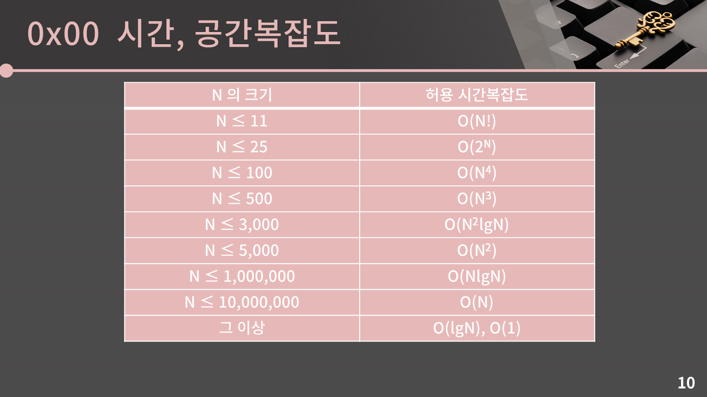

# 이모티콘 할인행사

https://school.programmers.co.kr/learn/courses/30/lessons/150368

---

import java.util.\*;

class Solution {
private static int[] per = {10, 20, 30, 40};
private static int[] max = {0, 0};
public int[] solution(int[][] users, int[] emoticons) {
find(users, emoticons, 0, new int[emoticons.length]);

        return max;
    }

    private void find(int[][] users, int[] emoticons, int depth, int[] cur){
        if (depth == emoticons.length){
            int[] result = {0, 0};
            for (int i=0; i<users.length; i++){
                int tmp = 0;
                for (int j=0; j<depth; j++){
                    if (cur[j]>=users[i][0]){
                        int price = (int) (emoticons[j]*(cur[j]*0.01));
                        tmp+=(emoticons[j] - price);
                    }
                }

                if (tmp>=users[i][1]){
                    result[0]++;
                }
                else{
                    result[1]+=tmp;
                }
            }
            if (result[0]>max[0]){
                max[0] = result[0];
                max[1] = result[1];
            }
            else if(result[0]==max[0]){
                max[1] = result[1] > max[1]? result[1]: max[1];
            }
            return;
        }

        for (int i=0; i<4; i++){
            cur[depth] = per[i];
            find(users, emoticons, depth+1, cur);
        }
    }

}

---

구현 문제는 아니다.
그럼 우선 시간복잡도를 계산해 어떤 알고리즘으로 풀어야 할지 고민해보자.
각 이모티콘의 할인율을 정해야 한다.
유저의 크기는 사실상 시간복잡도에 영향을 미치지 않는다.
(계산 시간의 차이는 있지만 사실상 하나의 식으로 표현이 가능하다.)
이모티콘의 개수는 최대 7개이며 이모티콘들은 10%, 20%, 30%, 40% 중 하나의 할인율을 가진다.
그렇다면 최악의 경우에 4^7(4^이모티콘의 개수) = 16384의 시간복잡도를 가지게 된다.
결국 이 문제는 모든 경우를 탐색하는 브루트포스로 풀어도 상관이 없는 문제다.

따라서 재귀 함수의 형태로 모든 할인율의 조합에 대해 최댓값을 계산했다.
